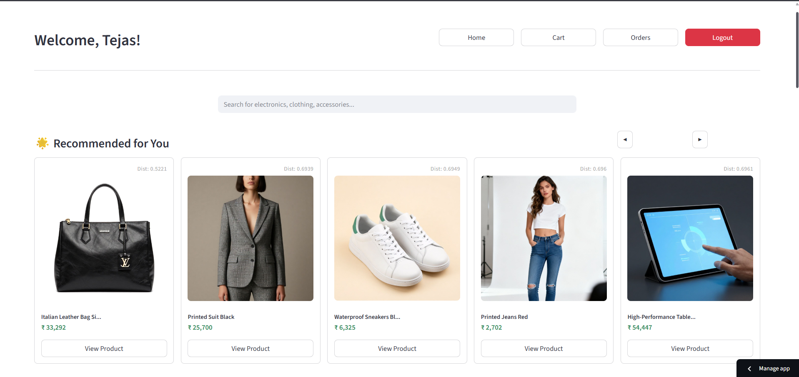
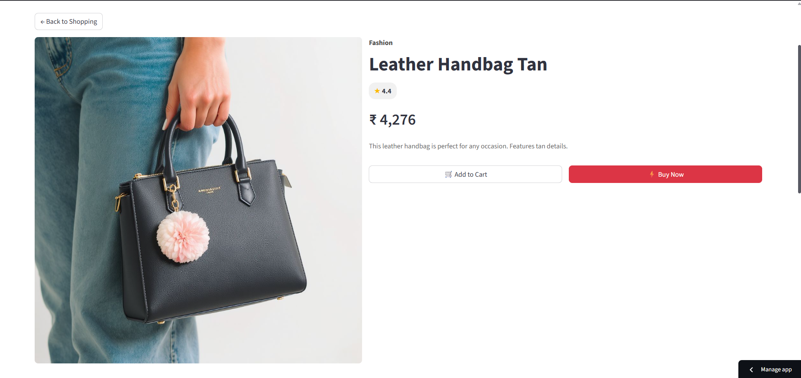
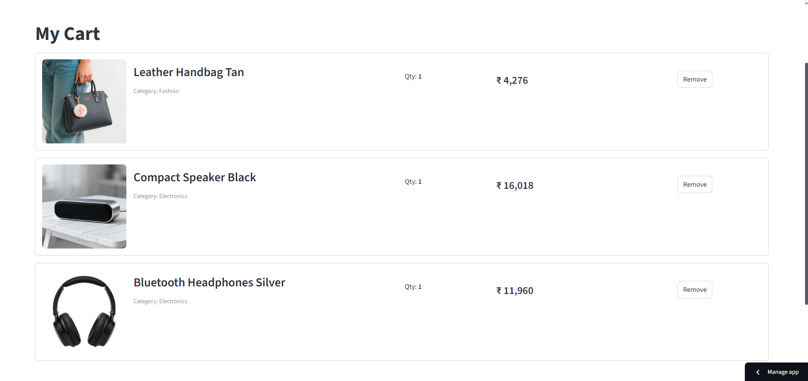
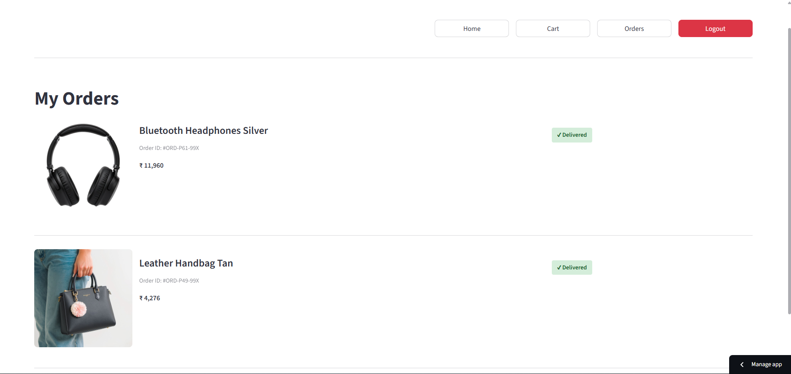
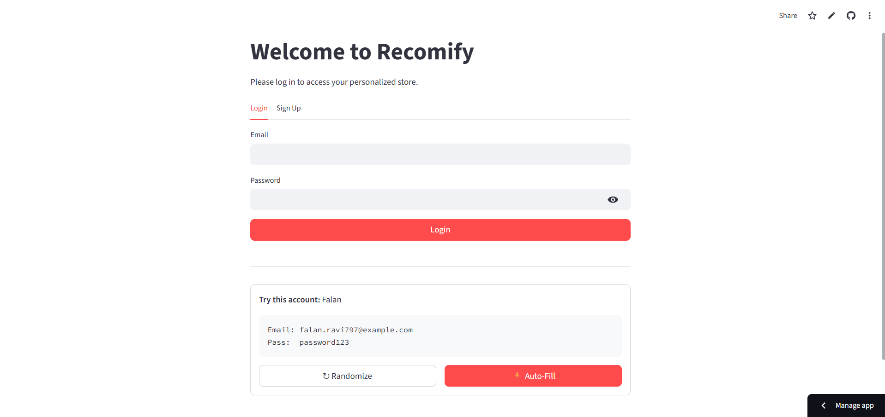

# AI-Enabled Recommendation Engine for E-Commerce

Built An AI-powered product recommendation model that suggests relevant products using **Item-Item Collaborative Filtering with K-Nearest Neighbors (KNN)**.

The project simulates a realistic e-commerce environment using synthetic datasets and dynamically updates recommendations based on user interactions. The system is implemented as a **multi-page Streamlit application** where users can browse products, interact with items, and receive personalized recommendations in real time.

---

## Live Demo

**Deployment Link**

[https://ai-recommendation-engine-sudhansukdash.streamlit.app/]

The deployed application allows users to explore the recommendation system through an interactive interface.
Note: If the app goes to sleep, press the Yes, get the app back up! button and wait for some time for it to load.

---

## Application Screenshots

| Home Page | Product Details |
|-----------|----------------|
|  |  |

| Cart Page | Orders Page |
|-----------|-------------|
|  |  |

### Login Page



---

## Demo Usage

You can explore the system in two ways.

### Use Test Credentials

A helper section on the login page automatically fetches **test credentials from the dataset**.  
This allows users to quickly log in and explore recommendations generated for an existing user profile.

### Create a New Account

Users can also create a new account through the **Sign Up page** and interact with the system using their own credentials.

---

## Key Features

- AI-powered product recommendation engine  
- Item-Item Collaborative Filtering using **K-Nearest Neighbors (KNN)**  
- Dynamic recommendations influenced by **live user interactions**  
- Synthetic e-commerce dataset simulating realistic user behavior  
- Multi-page Streamlit application  
- Product discovery through related item recommendations  

---

## Tech Stack

### Interface
- Streamlit

### Machine Learning
- Item-Item Collaborative Filtering
- K-Nearest Neighbors (KNN)

### Data Processing
- Python  
- Pandas  
- NumPy  
- Scikit-learn  

### Dataset Generation
- Faker  
- random  

### Other Tools
- Pickle (model serialization)  
- Requests  
- tqdm
---

## Data Generation and Preparation

The project uses a **synthetic e-commerce dataset** to simulate a realistic marketplace environment.  
Three main datasets are generated during the pipeline:

- **User dataset**
- **Product dataset**
- **Interaction dataset**

Synthetic data is generated using libraries such as **Faker**, **random**, and **pandas**. Product data is built using a category-based template system where product names are composed from base products, adjectives, and variants, description, image link, ratings, etc.

Example structure:

- Base Product: Smartphone  
- Adjective: Ultra  
- Variant: Pro Max  

Generated name example:

Ultra Smartphone Pro Max

Pricing variations are introduced through **variant-based price multipliers**, allowing products with different variants to simulate realistic pricing tiers.

To simulate real-world datasets, controlled inconsistencies and noisy category mappings are introduced during generation. These are later corrected using data cleaning techniques.

Data cleaning is performed using **pandas** along with fuzzy matching techniques to normalize product categories and correct naming inconsistencies.

Product images are generated using an external image generation API. Product descriptions and search terms are used as prompts to generate images, which are then downloaded and stored locally for use within the application. After the product images are generated in the cleaning script itself, the online links are replaced by local storage links.

---

## Interaction Modeling

User behavior is simulated through a synthetic **interaction dataset** that models how users interact with products in an e-commerce platform.

Interaction types include:

- View
- Wishlist
- Cart
- Purchase

Each interaction type is mapped to a numerical weight representing user intent.

| Interaction | Weight |
|-------------|--------|
| View | 0.5 |
| Wishlist | 3 |
| Cart | 5 |
| Purchase | 30 |

A **popularity bias** is also introduced to mimic real-world marketplaces, where a small percentage of products receive the majority of user interactions.

User behavior is further influenced by **user segmentation**, such as:

- Student
- Employed
- Unemployed

These segments influence interaction patterns and product preferences within the dataset.

The resulting interaction data is transformed into a **User–Item matrix**, which is normalized and then transposed into an **Item–User matrix** for use by the recommendation model.

---

## Recommendation Engine

The recommendation logic is implemented inside a dedicated recommender module located in the `utils` directory.

The system generates two main types of recommendations:

- **Homepage recommendations** based on user interaction history
- **Product-level recommendations** that suggest similar products on the product detail page

The recommendation engine prioritizes **live session interactions** so that recommendations adapt quickly as the user interacts with products during a browsing session.

Recent interactions are given higher importance than older historical interactions, allowing the system to dynamically adjust recommendations based on the user's most recent activity.

A separate script is also provided to test the recommender system from the command line. This script allows recommendations to be generated for a specific user ID and demonstrates how live interactions influence recommendation results.

---

## Model Evaluation

The recommendation model was evaluated using standard information retrieval metrics:

- **Precision**
- **Recall**
- **F1 Score**

An evaluation script was used to analyze recommendation quality and fine-tune certain parameters of the system to improve overall performance.
---

## Application Interface

The recommendation system is deployed as a **multi-page Streamlit application** that simulates a simplified e-commerce platform.

The application includes the following pages:

- **Home Page** – Displays personalized product recommendations
- **Product Details Page** – Shows product information and related item recommendations
- **Cart Page** – Allows users to manage selected products
- **Orders Page** – Displays previously placed orders
- **Login / Signup Page** – Handles user authentication

Users can browse products, interact with items, and observe how recommendations update dynamically based on their behavior.

---

## Project Structure

```
ai-recommendation-engine/
│
├── app/
│   ├── main.py
│   ├── components.py
│   └── pages/
│
├── utils/
│   └── recommender.py
│
├── pipeline/
│   ├── 01_...
│   ├── 02_...
│   ├── ...
│   └── 11_...
│
├── data/
│   ├── raw/
│   ├── processed/
│   ├── images/
│   └── models/
│
├── requirements.txt
├── LICENSE.txt
└── README.md
```

---

## Running the Project

If you want to regenerate the entire dataset and model pipeline from scratch, follow these steps.

### 1. Clone the Repository

```bash
git clone https://github.com/yourusername/project-name
cd project-name
```

---

### 2. Clean Generated Data

Delete the contents inside the following folders located in the `data` directory:

- `data/images`
- `data/models`
- `data/processed`

This ensures the pipeline runs from a clean state.

---

### 3. Run the Pipeline

The project includes numbered pipeline scripts for dataset generation and model building.

Run the scripts sequentially from **01 to 09**.

```
01_...
02_...
03_...
...
09_...
```

These scripts perform tasks such as:

- Generating synthetic datasets
- Cleaning product data
- Creating interaction data
- Building the user–item matrix
- Training the recommendation model
- Generating serialized model files

Scripts **10 and 11 are optional** and are used only for testing recommendations and evaluating the model.

---

### 4. Image Generation (Optional)

Pipeline step **05** generates product images using an external API.

This step requires a `.env` file containing the API key.

Example:

```
API_KEY=your_api_key_here
```

You could use any image gen model api key in .env file.

---

### 5. Run the Application

Once the pipeline has completed, start the Streamlit application:

```bash
streamlit run app/main.py
```

The application will open in your browser and allow you to interact with the recommendation system.

---

## License

This project is licensed under the terms described in the **LICENSE.txt** file included in the repository.